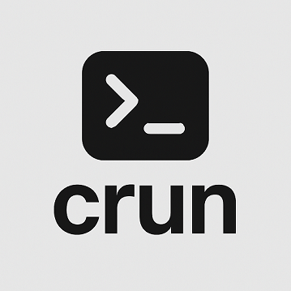

# **CRUN — کامپایل و اجرای آسان کدهای C/C++**


**CRUN** یک ابزار خط فرمان مینیمال و چندسکویی (cross-platform) است که فرایند کامپایل و اجرای برنامه‌های C و ++C را تنها با یک دستور ساده می‌کند — مناسب برای دانشجویان، توسعه‌دهندگان و علاقه‌مندان به برنامه‌نویسی.

---

## 🚀 قابلیت‌ها

- ✅ کامپایل و اجرای سریع فایل‌های `.c` و `.cpp`
- 🧠 انتخاب هوشمند کامپایلر: GCC/G++ یا Clang/Clang++
- 🐞 پشتیبانی از اشکال‌زدایی (debug) با GDB و LLDB
- 🧪 ادغام‌شده با AddressSanitizer برای تشخیص خطاهای حافظه
- 🧾 امکان ارسال آرگومان به برنامه در زمان اجرا
- 💻 قابل استفاده در هر دو سیستم‌عامل **ویندوز** و **لینوکس**

---

## 🛠️ پیش‌نیازها

اطمینان حاصل کنید ابزارهای زیر روی سیستم شما نصب شده‌اند و در مسیر (PATH) سیستم قرار دارند:

- **GCC/G++ یا Clang/Clang++** — الزامی برای کامپایل
- **GDB یا LLDB** — اختیاری برای حالت اشکال‌زدایی
- **ویندوز**: از `crun.bat` استفاده کنید.
- **لینوکس**: از `crun.sh` استفاده کنید.

---

## 📦 نصب

### در **ویندوز**:
1. فایل `crun.bat` را دانلود کنید.
2. آن را در پوشه‌ای قرار دهید که در مسیر PATH سیستم شما باشد (مثلاً `C:\Windows\System32`).
3. Command Prompt را باز کرده و دستور زیر را اجرا کنید:
   ```cmd
   crun
   ```

### در **لینوکس**:
1. فایل `crun.sh` را دانلود کنید.
2. آن را اجرایی (executable) کنید:
   ```bash
   chmod +x crun.sh
   ```
3. فایل را به یکی از پوشه‌های PATH منتقل کنید:
   ```bash
   sudo mv crun.sh /usr/local/bin/crun
   ```
4. تست کنید:
   ```bash
   crun
   ```

---

## 🧪 استفاده

```bash
crun [mode] filename.c/.cpp [program_args]
```

### حالت‌ها (Modes)

| حالت | توضیح |
|------|-------|
| g    | کامپایل با GCC/G++ (پیش‌فرض) |
| d    | کامپایل با نمادهای اشکال‌زدایی و اجرا با GDB |
| c    | کامپایل با Clang/Clang++ |
| cd   | کامپایل و اشکال‌زدایی با LLDB |
| s    | کامپایل با AddressSanitizer |
| h    | نمایش پیام راهنما |

---

## 📘 مثال‌ها

```bash
crun hello.c
crun d main.cpp
crun s app.c input.txt
crun c program.cpp arg1 arg2
```

---

## 📂 پوشه Examples

پوشه `examples/` شامل فایل‌های نمونه زیر است:

- `test.c`: یک برنامه ساده C با پردازش آرگومان‌ها
- `hello.cpp`: برنامه کلاسیک "سلام دنیا" به زبان ++C
- `input.txt`: فایل ورودی نمونه برای تست

---

## 🔖 نکات

- مطمئن شوید ابزارهایی مثل gcc، g++، gdb و clang نصب شده‌اند و در مسیر `PATH` قرار دارند.
- مسیرهایی که شامل فاصله هستند باید داخل کوتیشن `" "` قرار گیرند.
- برای حالت‌های اشکال‌زدایی، نصب بودن GDB (در ویندوز/لینوکس) یا LLDB (در macOS/لینوکس) ضروری است.

---

## 📝 مجوز (License)

این پروژه تحت مجوز MIT منتشر شده است. جزئیات بیشتر را در فایل LICENSE ببینید.

---

## 🤝 مشارکت

مشارکت در این پروژه از طریق Pull Request و Issue کاملاً خوش‌آمد است!  
اگر ایده‌ای دارید یا باگ‌هایی پیدا کردید، با هم پروژه را بهتر کنیم 💡

---

